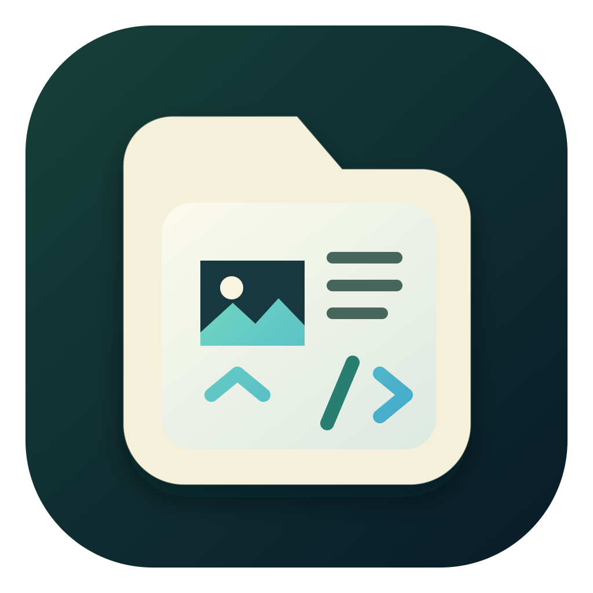
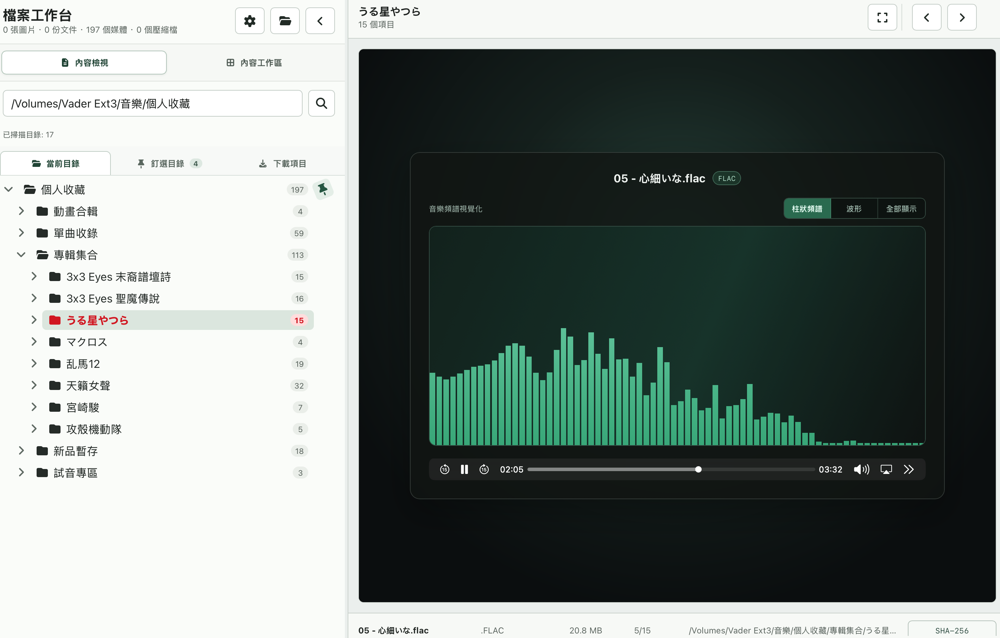

<div align="center">
  
  <h1>FastFileViewer</h1>
  <p>以 Go、Wails、React 與 TypeScript 建立的 macOS 本機優先檔案工作台。</p>
</div>

<p align="center">
  <a href="README.md">繁體中文</a> |
  <a href="README.en.md">English</a> |
  <a href="README.ja.md">日本語</a>
</p>

## 畫面預覽



## 功能

- 逐目錄掃描本機資料夾，建立圖片、文件、程式碼、影音與字幕的統一內容樹。
- 不解壓縮直接瀏覽 ZIP、TAR、TGZ 與 TAR.GZ 內的支援內容。
- 預覽 PNG、JPEG、GIF、WebP、BMP、SVG、TIFF 與 HEIC。
- 顯示 TXT、Markdown、JSON、CSV、TSV、常見設定檔與多種程式語言。
- 提供 Markdown Render、程式碼語法高亮、JSON 樹及可搜尋排序的 CSV／TSV 表格。
- 播放常見影片與音樂格式；音樂視覺化可選柱狀頻譜、波形或全部顯示，並記憶選擇。
- 瀏覽其他圖片或文件時，音樂會保留播放時間、播放／暫停、音量與靜音狀態；切換至影片時自動暫停背景音樂。
- 音樂自然播完後會略過非音訊項目，自動跳到下一首並依目前清單順序循環播放。
- 柱狀頻譜採 32768 點浮點 dB FFT 與對數中心頻率插值；取樣率允許時涵蓋 18 Hz–24 kHz。
- 音訊支援 MP2／MP3、M4A／M4B／ALAC、WAV、AAC、FLAC、OGG／OPUS、AIFF、CAF、WMA、APE、WavPack、AC-3、AMR 與 MKA。
- FLAC 優先使用 WebKit 原生解碼；若原生解碼失敗，會自動建立暫存 M4A 相容檔。
- 發布 App 已內建 LGPL FFmpeg，可將 MKV 自動轉封裝或轉碼為暫存 MP4 播放；開發模式沒有 Bundle 時才使用本機 `ffmpeg`。
- MKV 改封裝成功後可選擇將可播放檔保存至原資料夾，並把原始檔移至垃圾桶，之後可直接播放而不必再次轉換。
- 自動配對同目錄的 VTT、SRT、ASS、SSA、SMI 與文字型 SUB 字幕。
- 在「下載項目」貼上或拖入公開 HTTP/HTTPS 網址，自動下載圖片、影片、文章與一般檔案；可直接存取的影片頁會解析 HTML／內嵌腳本中的 `.m3u8`。
- 影片頁只有一個 `.m3u8` 時自動下載；找到多個時顯示複選對話框，每個選項建立獨立下載項目。
- 支援未加密、已結束的 `.m3u8` VOD；主播放清單會選擇最高頻寬版本並合併媒體片段。
- 可分別設定要掃描的圖片、文件與影音／字幕格式。
- 三區式內容工作區、持久化釘選目錄、批次載入及可取消作業。
- 跨資料夾與壓縮檔多選匯出、SHA-256 檢查及完全重複檔案偵測。
- 目錄索引、縮圖及相鄰圖片快取均保存在本機，不需網路服務。
- 繁體中文、英文與日文介面。

## 開源版

公開原始碼版本不使用 StoreKit、不啟用 App Sandbox，也不包含本機發布憑證或個人化設定。應用程式可存取目前登入帳號原本就有權限的檔案與目錄；macOS 對桌面、文件、下載項目或外接磁碟等隱私保護位置仍可能要求授權。

## 開發需求

- Apple Silicon Mac 與 macOS 12 或更新版本
- Go 1.26.4 或相容版本
- Node.js 與 npm
- Xcode Command Line Tools
- `rsync`
- `pkg-config`、libopus、libvpx（建立內建 LGPL FFmpeg 時需要，可用 `brew install pkg-config opus libvpx` 安裝）

建置腳本會使用 `go.mod` 指定的 Wails v2 版本。

## 取得原始碼

```bash
git clone https://github.com/VaderChen/FastFileViewer.git
cd FastFileViewer
```

## 開發模式

```bash
./run.sh
```

`run.sh` 會在本機暫存目錄建立開發鏡像，避免外接磁碟上的 AppleDouble 檔案與大量小檔案影響 Wails。

## 建置 macOS App

```bash
./scripts/build-ffmpeg-macos.sh
./build.sh
```

輸出：

```text
dist/FastFileViewer.app
```

建置流程會執行 Go vet、race test、前端測試與 npm audit，並在 App Bundle 的 `Contents/Resources` 中加入：

- `Licenses/GPL-3.0.txt`
- `Licenses/THIRD-PARTY-NOTICES.md`
- `Licenses/THIRD-PARTY-LICENSES.txt`
- `build-metadata.json`

預先建置版本可由 [GitHub Releases](https://github.com/VaderChen/FastFileViewer/releases) 取得。

DMG 發布工具與簽署憑證設定不包含在 Repository；請在私有發布環境中執行發布流程。

## 資料與隱私

- 檔案掃描、Render、縮圖、媒體播放與內容分析均在本機完成。
- 只有使用者在「下載項目」明確貼上或拖入網址時，App 才會對該公開 HTTP/HTTPS 位址建立連出連線。
- 下載器不使用瀏覽器 Cookie、登入狀態或自訂認證，不支援 DRM、付費牆、加密 HLS 或即時 HLS。
- 網頁解析器不執行 JavaScript，只檢查最多 32 MB 的 HTML 與內嵌腳本文字；最多列出 16 個 `.m3u8` 候選。
- 需要瀏覽器 Cookie、登入或反機器人驗證的網站不會繞過保護，介面會提示改貼直接 `.m3u8` 網址。
- 下載內嵌串流時只傳送由來源頁推導、已移除 query 與 fragment 的 Referer／Origin。
- 下載器拒絕 localhost、私有 IP、link-local 與其他非公開網路位址，重新導向也會再次驗證。
- 下載內容上限為單檔 4 GB，文字／HTML 與播放清單上限為 32 MB，檔案儲存於 `~/Downloads/FastFileViewer`。
- App 不執行顯示的程式碼或 Markdown 原始 HTML。
- Markdown 不載入遠端圖片或連結資源。
- 目錄索引與縮圖位於 `os.UserCacheDir()` 下的 `FastFileViewer` 目錄。
- App 只會匯出到使用者主動選取的位置。

請勿提交 `.env*`、安裝包、本機發布資產、個人檔案或包含真實路徑的除錯資料。安全問題請參閱 [SECURITY.md](SECURITY.md)。

## 授權

Copyright (C) 2026 VaderChen.

本專案採雙軌授權：

1. 開放原始碼使用遵循 [GNU General Public License v3.0](LICENSE)。
2. 無法遵循 GPLv3、需要閉源整合或其他商業條款者，可另行取得[商業授權](COMMERCIAL-LICENSE.md)。

商業授權僅涵蓋授權方有權另行授權的程式碼與資產；第三方套件仍適用各自條款。第三方清冊請參閱 [THIRD-PARTY-NOTICES.md](THIRD-PARTY-NOTICES.md)。

正式 Contributor License Agreement 完成前，僅接受 Issue、文件回報與設計討論，詳見 [CONTRIBUTING.md](CONTRIBUTING.md)。
