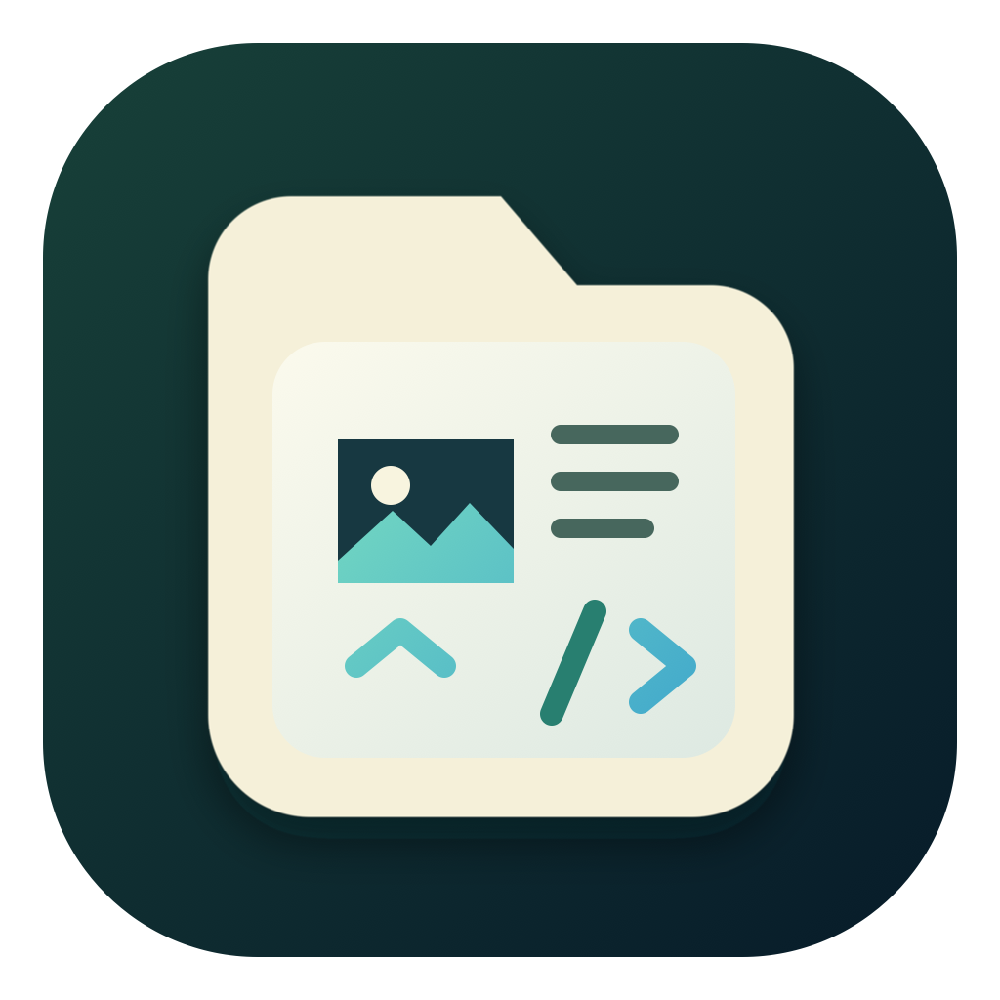

<div align="center">
  
  <h1>FastFileViewer</h1>
  <p>以 Go、Wails、React 與 TypeScript 建立的 macOS 本機優先檔案工作台。</p>
</div>

<p align="center">
  <a href="README.md">繁體中文</a> |
  <a href="README.en.md">English</a> |
  <a href="README.ja.md">日本語</a>
</p>

## 最新版本

[1.26.1003 build 2237](https://github.com/VaderChen/FastFileViewer/releases/tag/1.26.1003-build-2237) 加入啟動時自動偵測更新、關於頁面的「偵測更新」，以及包含進度的下載、安裝與重啟流程；同時提供圖片／影音資訊、相機 RAW 預覽與獨立的程式語言格式設定。目錄掃描、HLS 解析、表格排序與狀態輪詢進一步減少重複工作及記憶體配置。支援 Apple Silicon、macOS 12 以上；RAW 相機格式依 macOS 支援範圍而定。

變更詳見 [Changelog](CHANGELOG.md)、[版本說明](doc/release-1.26.1003-build-2237.md)、[函式檢查報告](doc/function-optimization-followup.md) 與[效能基準及量測限制](doc/performance.md)。

## 功能

- 逐目錄掃描本機資料夾，建立圖片、文件、程式碼、影音與字幕的統一內容樹。
- 從 Finder 或 macOS `open` 開啟檔案時，會先顯示指定檔案，再於背景完成所在目錄索引。
- 不解壓縮直接瀏覽 ZIP、TAR、TGZ 與 TAR.GZ 內的支援內容。
- 預覽 PNG、JPEG、GIF、WebP、BMP、SVG、TIFF 與 HEIC。
- 支援各家常見相機 RAW 副檔名（DNG、CRW／CR2／CR3、NEF／NRW、ARW／SRF／SR2、RAF、ORF、RW2、PEF、SRW、ERF、MRW、GPR、R3D、FFF、3FR、IIQ、X3F 等）；預覽使用 macOS 原生 ImageIO 解碼，實際相容性依 macOS 支援的相機型號而定。
- Finder 關聯檔案會使用與 App 不同的分類圖示；文件、圖片、媒體／字幕及壓縮檔分開顯示。建置時可用 `FASTFILEVIEWER_FILE_ICON_STYLE=classic|monochrome|vivid ./build.command` 選擇預設樣式。
- 選取圖片時顯示尺寸、色彩模型及常見 EXIF（相機、鏡頭、拍攝時間、曝光、ISO、焦段與 GPS）資訊。
- 顯示 TXT、Markdown、JSON、CSV、TSV、常見設定檔與多種程式語言。
- 提供 Markdown Render、程式碼語法高亮、JSON 樹及可搜尋排序的 CSV／TSV 表格。
- 文件配色預設使用 `GitHub Light`；可切換其他主題，選擇會保存在本機。
- 播放常見影片與音樂格式；音樂視覺化可選柱狀頻譜、波形或全部顯示，並記憶選擇。
- 選取影片或音訊時顯示容器、長度、位元率、編碼、解析度、影格率、取樣率與聲道等影音 metadata。
- 音樂視覺化提供 `Colors` 控制項；開啟後 BAR 會在橘、黃、綠、青、藍、紫藍色系間緩慢變色，關閉後維持固定綠色。
- 瀏覽其他圖片或文件時，音樂會保留播放時間、播放／暫停、音量與靜音狀態；切換至影片時自動暫停背景音樂。
- 音樂自然播完後會略過非音訊項目，自動跳到下一首並依目前清單順序循環播放。
- 柱狀頻譜採 32768 點浮點 dB FFT 與對數中心頻率插值；取樣率允許時涵蓋 10 Hz–20 kHz。
- 音訊支援 MP2／MP3、M4A／M4B／ALAC、WAV、AAC、FLAC、OGG／OPUS、AIFF、CAF、WMA、APE、WavPack、AC-3、AMR 與 MKA。
- FLAC 優先使用 WebKit 原生解碼；若原生解碼失敗，會自動建立暫存 M4A 相容檔。
- 發布 App 已內建 LGPL FFmpeg，可將 MKV 自動轉封裝或轉碼為暫存 MP4 播放；開發模式沒有 Bundle 時才使用本機 `ffmpeg`。
- MKV 改封裝成功後可選擇將可播放檔保存至原資料夾，並把原始檔移至垃圾桶，之後可直接播放而不必再次轉換。
- 自動配對同目錄的 VTT、SRT、ASS、SSA、SMI 與文字型 SUB 字幕。
- 在「下載項目」貼上或拖入公開 HTTP/HTTPS 網址，自動下載圖片、影片、文章與一般檔案；可直接存取的影片頁會解析 HTML／內嵌腳本中的 `.m3u8`。
- 影片頁只有一個 `.m3u8` 時自動下載；找到多個時顯示複選對話框，每個選項建立獨立下載項目。
- 支援未加密、已結束的 `.m3u8` VOD；主播放清單會選擇最高頻寬版本並合併媒體片段。
- 可分別設定要掃描的圖片、文件、程式語言與影音／字幕格式。
- 三區式內容工作區、持久化釘選目錄、批次載入及可取消作業。
- 跨資料夾與壓縮檔多選匯出、SHA-256 檢查及完全重複檔案偵測。
- 目錄索引、縮圖及相鄰圖片快取均保存在本機，不需網路服務。
- 繁體中文、英文與日文介面。

## 公開原始碼版

公開原始碼版本不使用 StoreKit、不啟用 App Sandbox，也不包含個人化設定。應用程式可存取目前登入帳號原本就有權限的檔案與目錄；macOS 對桌面、文件、下載項目或外接磁碟等隱私保護位置仍可能要求授權。

## 開發需求

- Apple Silicon Mac 與 macOS 12 或更新版本
- Go 1.26.6 或相容版本
- Node.js 與 npm
- Xcode Command Line Tools
- CMake 與 `pkg-config`（建立內建影音相依套件時需要，可用 `brew install cmake pkg-config` 安裝）

建置腳本會使用 `go.mod` 指定的 Wails v2 版本。

## 取得原始碼

```bash
git clone https://github.com/VaderChen/FastFileViewer.git
cd FastFileViewer
```

## 開發模式

```bash
./run.sh
```

`run.sh` 會直接在專案目錄啟動 Wails，前端依賴安裝於 `frontend/node_modules`，指定版本的 Wails CLI 安裝於 `build/tools`。

## 建置 macOS App

```bash
./scripts/build-codec-deps-macos.sh
./scripts/build-ffmpeg-macos.sh
./build.sh
```

影音相依套件會以 macOS 12 為目標從原始碼建立，存放於 `third_party/codecs` 與 `third_party/ffmpeg`；App 建置會拒絕需要較新 macOS 的函式庫。

輸出：

```text
dist/FastFileViewer.app
```

建置流程會執行 Go vet、race test、前端測試與 npm audit，並在 App Bundle 的 `Contents/Resources` 中加入：

- `Licenses/LICENSE*.md`
- `Licenses/THIRD-PARTY-NOTICES.md`
- `Licenses/THIRD-PARTY-LICENSES.txt`
- `build-metadata.json`

預先建置版本可由 [GitHub Releases](https://github.com/VaderChen/FastFileViewer/releases) 取得。

App 啟動時會自動偵測 GitHub 的正式新版；也可從「設定 → 關於 → 偵測更新」手動檢查。有新版時會顯示版本及更新說明，按「更新並重新啟動」後會下載並顯示進度，自動關閉 App、安裝及重新開啟。下載及準備期間可取消；開始替換後由獨立視窗顯示安裝進度。原版本會保留至新版畫面啟動完成，失敗時嘗試還原。自動更新需使用正式簽署的 Apple Silicon App，並安裝在目前帳號可寫入的位置；從 DMG 直接執行時請先拖入「應用程式」。

## 資料與隱私

- 檔案掃描、Render、縮圖、媒體播放與內容分析均在本機完成。
- 啟動及手動偵測更新時，App 會連線至 GitHub 查詢正式發行資訊；確認更新後才下載安裝包，不傳送本機檔案、目錄或帳號憑證。
- 使用者在「下載項目」明確貼上或拖入網址時，下載器會對該公開 HTTP/HTTPS 位址建立連出連線。
- 下載器不使用瀏覽器 Cookie、登入狀態或自訂認證，不支援 DRM、付費牆、加密 HLS 或即時 HLS。
- 網頁解析器不執行 JavaScript，只檢查最多 32 MB 的 HTML 與內嵌腳本文字；最多列出 16 個 `.m3u8` 候選。
- 需要瀏覽器 Cookie、登入或反機器人驗證的網站不會繞過保護，介面會提示改貼直接 `.m3u8` 網址。
- 下載內嵌串流時只傳送由來源頁推導、已移除 query 與 fragment 的 Referer／Origin。
- 下載器拒絕 localhost、私有 IP、link-local 與其他非公開網路位址，重新導向也會再次驗證。
- 下載內容上限為單檔 4 GB，文字／HTML 與播放清單上限為 32 MB，檔案儲存於 `~/Downloads/FastFileViewer`。
- App 不執行顯示的程式碼或 Markdown 原始 HTML。
- Markdown 不載入遠端圖片或連結資源。
- 目錄索引與縮圖位於 `os.UserCacheDir()` 下的 `FastFileViewer` 目錄。
- App 只會匯出到使用者主動選取的位置。

請勿提交 `.env*`、安裝包、本機發布資產、個人檔案或包含真實路徑的除錯資料。安全問題請參閱 [SECURITY.md](SECURITY.md)。

## 授權

Copyright (C) 2026 VaderChen.

本專案採用[原始碼公開・禁止商業販售授權 1.1](LICENSE.md)，允許符合條款的非販售使用、修改及免費分享，包含公司或組織內部自用。完整條件以授權全文為準；另行授權的洽詢方式見[授權政策](COMMERCIAL-LICENSE.md)。

本授權為含商業販售限制的自訂原始碼公開授權。第三方元件仍適用各自條款，請參閱 [THIRD-PARTY-NOTICES.md](THIRD-PARTY-NOTICES.md)。

正式 Contributor License Agreement 完成前，僅接受 Issue、文件回報與設計討論，詳見 [CONTRIBUTING.md](CONTRIBUTING.md)。
